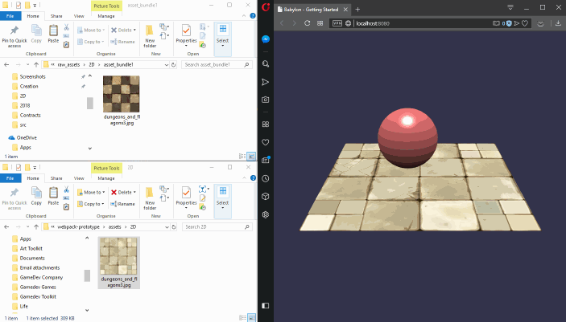

# Ready (Soon) for Hot Module Reload

Come with an example of how to use the Hot Module Reload for swapping texture at runtime:



# Ready (Soon) for Simple Shader Import

See the branch `shader_import`.

# Getting Started

Assuming that `npm` is installed:

1) Run:

```
npm install
``` 

That should add a folder `node_modules` containing all the dependencies of the project.

2) If `webpack` is not already installed, run:
   
```
npm install --save-dev webpack
npm install --save-dev webpack-cli
```

3) Install the typescript compiler and loader by running:

```
npm install --save-dev typescript ts-loader
```

4) Then install these `webpack` plugins:
```
npm i -D copy-webpack-plugin
```

That will allow webpack to copy the `index.html` file in the build.

```
npm install webpack-dev-server --save-dev
```
That will allow to run a local server while webpack updates the build automatically, when you modify a file.

4) run the project:
```
npm run dev:server
```

Go in your internet browser at http://localhost:8080/

5) Note that the webpack-dev-server does not write files on the disk. To export your build ready (and run it on another local server or a remote server). Run:

```
npm run build
```

## Acknowledgements

Thanks to **brianzinn** from [http://www.html5gamedevs.com](http://www.html5gamedevs.com) for their walkaround concerning the browser caching that was preventing the texture hot swapping to work.